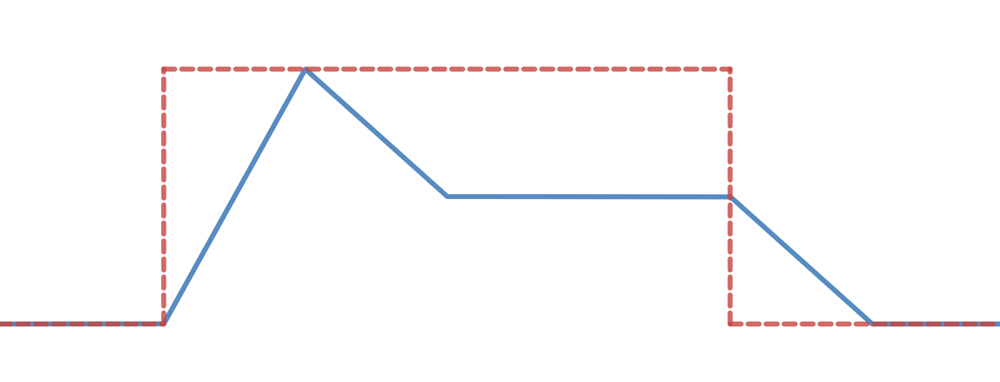

# Create your own syntesizer with Rust

The goal of this workshop is to learn a bit about Rust, a bit about sound, and hopefully end up with a playable syntesizer

## Build and run the project
Build: `cargo build`
Run: `cargo run`

# Tasks

## 1. Create a simple oscillator
An oscillator is a component that generates a periodic signal of a given frequency. There are different kinds of oscillators, but the most common are sine, sawtooth, square and triangle. Feel free to look these up.

In this task we are creating a simple oscillator. You are free to choose wich kind of periodic signal to use, but keep in mind that some signals sounds more dull than others. (Looking at you, sine wave).

Start by cloning the repo and and familiarize yourself with the code.

The whole synthesizer will be implemented within the closure function `synth` located in `./main.rs`. This function will be called by the audioprocessing thread for each new sample to be generated.

The function takes one argument,`action`, that is an Option of `i32` which is a number from 0 to 15. This value corresponds to key currently being pressed. The `synth` function returns a value representing the oscillators output signal. _We will not need to worry about this argument until task three._

<details>
<summary>Hint</summary>

A sine oscillation wave can be expressed by the following.

y(t) = A * sin(2 &#960; &#402; t &#43; &phi;), where A, &#402;, and &phi; are constant parameters.

A = amplitude\
&#402; = ordinary frequency. Try `440Hz`\
&phi; = phase

Sinusiod function is explained in detail [here](https://en.wikipedia.org/wiki/Sine_wave).
Phase are explained in detail [here](https://en.wikipedia.org/wiki/Phase_(waves)#Formula_for_phase_of_an_oscillation_or_a_wave).

You're highly encouraged to implement another type of oscillating wave:
- [Square wave](https://en.wikipedia.org/wiki/Square_wave)
- [Triangle wave](https://en.wikipedia.org/wiki/Triangle_wave)
- [Sawtooth wave](https://en.wikipedia.org/wiki/Sawtooth_wave)
</details>

## 2. Visualizing the oscillator
Before we proceed with making a complete synthesizer, we wish to implement a graphical representation of the soundwaves we generate.

### Some theory: Communication between threads
Since real time audio comes with some demands, the processing is done in a  thread separate from the UI-thread. Therefore, we need to communicate the generated sound wave to the UI-thread where it will be rendered on the screen.

In many languages the communication between threads are primarily done by limiting resource access, often by the use of mutexes. This limits the access to reading and modifying a resource to one thread at a time, making all other threads await their turn. Applications using this strategy often have problems with data races, deadlocks and starvation, and debugging these can be a challenge.

In addition to mutexes, Rust supports communication between threads via 
channels. Sending a signal through a channel will not block the sender, and only some calls will block the reciever. 

Below, we see an example of how to create channel that sends data of the type `MyChannelType`.

```rust
use std::sync::mpsc::channel;
(my_sender, my_receiver) = channel::<MyChannelType>();
```

Remember that when using channels, one is still bound by the ownership rules of Rust. By sending a variable down a channel, you also give up the ownership of it.

### Task
In this task you are going to send some data of the type `GraphEvent` (as defined in `./types.rs`) to the UI-thread. You must create a channel of this type, and pass the sender and reciever to `setup_synth()` and the UI-object respectively. You must also find out how to create an instance of `GraphEvent`.

For the UI to use the receiver channel, you must pass it as an argument to the UI constructor function, `Ui::new(...)`. If you look at this constructor function, you'll see that the `GraphEvent` argument has type signature `Option<Receiver<GraphEvent>>`, which means that you'll have to wrap the channel receiver in an option, like this: `Some(receiver)`.

<details>
<summary>Hint</summary>

The data points in `GraphEvent` are held in a queue og type `VecDeque<f64>`.
</details>

## 3. Create the keyboard

### The relation between tones and frequencies
`ISO 16` defines the musical note of `A above middle C` to have a frequency of _440.0 Hz_, and from this frequency, all other notes can be derived.     

Playing an octave higher is the same as doubling the frequency played for any given tone. `440.0 * 2.0 = 880.0 Hz` is one octave up and `880.0 * 2.0 = 1760.0 Hz` is two octaves up from the `ISO 16-A`

There are twelve notes in one octave, and due to the exponential nature of notes there is a number `x` that describes the relationship between them. Since we know that moving one octave up means doubling the frequency, we can use this to find `x`:

```
1.0 * x * x * x * x * x * x * x * x * x * x * x * x = 2.0
x^12 = 2.0
x = 12th_root(2.0)
x = 1.05946309436
```


### Task
In this task we implement a function that takes the value of the `action` parameter which correspons to the key being pressed, and returns the frequency of the note to be played. If implemented correctly, you should be able to change the sound by pressing the top two letter rows on your keyboard.


<details>
<summary>Hint</summary>

</details>

## 4. Implement an amplifier 
By now we have an oscillator that generates sound, and a keyboard that can be used to change the tone. But notice how the tone plays, even when the keyboard is not pressed.

### Task
In this task we are creating an amplifier for our synth that will adjust the 
volume of the input signal from the oscillator in accordance with an input parameter `gate`. The formula will then be `output = input * gate`.

In the case where no key is pressed, the value of `gate` should be `0`. When the key is pressed, the value should be `1`. Notice, however, that this makes for a very sudden jump in volume when a key is pressed. This might be heard as a "popping" noice in your headset/speakers. We will address this in task 5.


<details>
<summary>Hint</summary>

The amp can be implemented as a function, or right into the synth-function.
</details>

## 5. Envelope v/ADSR
Our syntesizer will now play only when keys are pressed, but it still sounds a bit boring. We will now fix this by implementing an ADSR-envelope that will be hooked in between the `gate` and the amplifier.

### ADSR
An ADSR (Attack, Decay, Sustain, Release) transforms a gate-input to a more dynamic signal. It contains an internal state-machine wih the states `Attack`, `Decay`, `Sustain`, `Release` and `Off`. Study the following figures.




We see that when the `gate` value (red dashed line) goes from 0 to 1 (when we press a key), the output value goes through the `attack`, `decay` and `sustain` state. When a key is released, the ADSR goes to the apropriatly named `release` state.


### Vising av slidere i UI-et
UI-et vi har satt opp for denne workshopen er i stand til å vise slidere som man kan bruke for å justere på parametre. Du står fri til å
velge hvor mange slidere du ønsker, hvilken range de skal ha, default-verdi og hvilken tekst som skal stå under slideren.

For å vise slidere i UI-et, må du definere opp et array av `Slider`-e og sende dem inn som parameter i `Ui::new(...)`. Ta en titt i
`./types.rs` for å se hvordan man kan lage instanser av denne typen.

Parameteren til `Ui::new(...)` for slidere har signatur `Option<&[Slider]>`, så her må du pakke inn slider-arrayet ditt i en `Some`.

Dersom du nå prøver å kjøre programmet, vil du kunne se at dine slidere blir tegnet på skjermen, men det er foreløpig ikke koblet opp
noen logikk til disse.

På samme måte som du brukte kanaler for å sende lyddata til UI-tråden i oppgave 2, må du her sende sliderdata fra UI-tråden tilbake til
synthesizeren din. Se i parameterlisten til `Ui::new(...)` for å finne ut hvilken type kanalen din må ha.

### Task

In this task we implement the ADSR component that will be hooked in between the gate value and the output of the synth. We will then add adjustable sliders for the ADSR-values.

I denne oppgaven skal du implemente en ADSR-komponent som skal kobles mellom gate og forsterker. Deretter skal du knytte konfigurerbare
felter for ADSR-en din til slidere i UI-et.


<details>
<summary>Hint</summary>

</details>

## 6. The rest of the f\*cking owl
Now that you have a working synthesizer, you are free to develop it even further if you wish. Some suggestions:

- Filters (low pass, band pass and high pass)
- Delay
- Reverb
- Flanging
- Portamento
